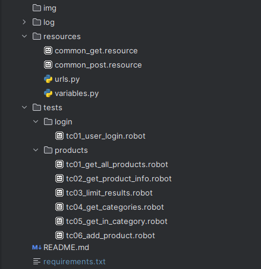

# Robot Framework API Project
## Automation API test project with Robotframework
## Short description
This robotframework test automation project has been made for testing puposes. Target of tests: https://fakestoreapi.com/
## Clone repository
```bash
$ git clone https://github.com/VladNachev/robotframework_api_project.git
```
## Environment setup
- Python
- Recomended IDE: Pycharm or VS Code
- pip
- libraries needed: 
  - robot framework
  - requests
  - robotframework-requests
  - robotframework-jsonlibrary
## requirements.txt
The requirements.txt file contains a list of the libraries needed. To install all the libraries in bulk, run the following command in cmd: 
```bash
$ pip install -r requirements.txt
```
## project structure

## some notes
Test cases are located in tests/products and tests/login. 
Keywords are located in common_get.resource and common.post.resource files. 
Variables are located in variables.py.
Basic URLs are located in urls.py.
## How to run Robot Framework test from command line?
Basic syntax:
```bash
$ robot [options] robot_files
```
Execute all test cases in folder(s):
```bash
$ robot .
```
Execute all test cases in single file:
```bash
$ robot tests/login/tc01_user_login.robot
```
Execute test cases by tags - all test cases in products folder have [Tag] products. Test cases in login folder have [Tag] login. Test cases can be executed by tags:
```bash
$ robot --include products .
```